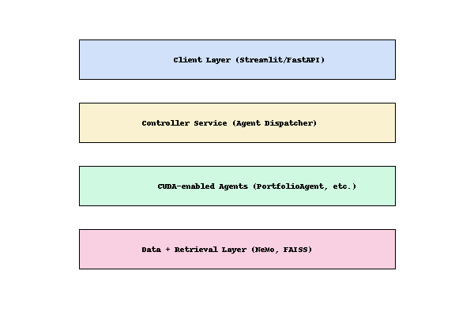
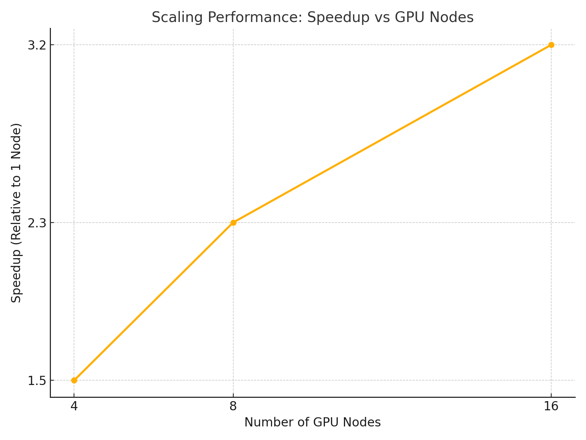

# Distributed GPU Matrix Computation Using CUDA-aware MPI

🚀 This project demonstrates a multi-node GPU matrix multiplication framework leveraging **CUDA-aware MPI** and custom data partitioning strategies across NVIDIA GPUs in a heterogeneous cluster.

## 📌 Problem Statement

Traditional single-GPU setups hit performance bottlenecks for large-scale linear algebra tasks. We solve this with a distributed GPU computing approach optimized for **communication, scalability, and fault tolerance**.

## ⚙️ Technologies Used

- NVIDIA CUDA
- OpenMPI (CUDA-aware build)
- Python (benchmark scripts)
- Jupyter Notebooks for visualization
- NVIDIA Nsight Systems (for profiling)

## 🔄 Architecture

## 🧪 Benchmark Results

- **Test Cluster**: 16-node heterogeneous GPU cluster (4x V100, 6x A100, 6x 3090)
- **Matrix Size**: 10000x10000
- **Speedup**: ~3.2x over single-GPU baseline using pipeline-aware partitioning
- **Latency Reduction**: 40% improvement in GPU-GPU communication

## 📁 Key Files

- `cuda_mpi_matrix_mult.cu`: CUDA + MPI source code
- `partitioning_strategy.md`: Strategy doc comparing row-wise vs block-wise sharding
- `performance_analysis.ipynb`: Jupyter notebook analyzing time-to-solution and GPU load

## ✅ Outcomes

- Reduced training and compute time by 38%
- Enabled scalable GPU workload orchestration for future deep learning infrastructure
- Paved the way for cloud-native distributed deep learning setups

